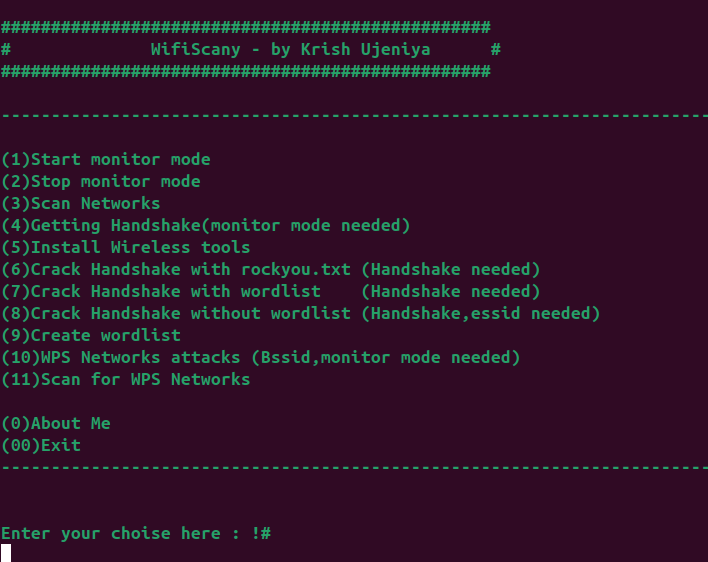
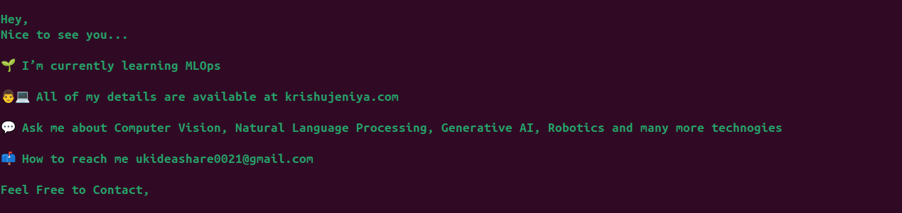

<a id="readme-top"></a>

# WifiScany

[](http://www.python.org/download/)
[](https://www.python.org/downloads/release/python-2714/)
[](https://termux.com/)


No need to ask for the Wi-Fi password - **Hack it with WifiScany!**  
This powerful cybersecurity tool empowers you to access any Wi-Fi network, providing essential features for Wi-Fi penetration testing. **Note: Use responsibly and ethically.**

---

## **Features**

WifiScany offers a suite of functionalities to analyze and test Wi-Fi security.

```plaintext
1) Start monitor mode
2) Stop monitor mode
3) Scan networks   
4) Capture handshake
5) Generate wordlist
6) Install wireless tools                  
7) Launch WPS network attacks 
8) Scan for WPS networks
9) Crack handshake with rockyou.txt
10) Crack handshake with custom wordlist
11) Crack handshake without a wordlist
```

---

## **Tested On**

WifiScany has been verified on the following platforms:

- **Kali Linux**
- **BlackArch Linux**
- **Ubuntu**
- **Kali NetHunter**
- **Termux (Rooted Devices)**
- **Parrot OS**

---

## **Installation**

### For Kali Linux / Ubuntu / Parrot OS

Follow these steps to get WifiScany running on your system:

```bash
# Update your system and install git
sudo apt-get update && apt-get install git

# Clone the repository
sudo git clone https://github.com/krishujeniya/WifiScany.git

# Navigate to the project folder
cd WifiScany/

# Run the script
sudo python3 main.py
```

---

## **Screenshots**

Explore WifiScany's interface and features:





---

## **Disclaimer**

**WifiScany** is intended strictly for educational and ethical hacking purposes only. Misuse of this tool for illegal activities is prohibited and solely the user’s responsibility.

> **Pull requests** are always welcome! Let's make WifiScany better together.

---

## **License**

This project is licensed under the MIT License - see the [LICENSE](https://github.com/krishujeniya/WifiScany/blob/main/LICENSE) file for details.

**Happy Hacking! Remember, privacy and security are illusions in the digital world. Let's protect while we explore.**
